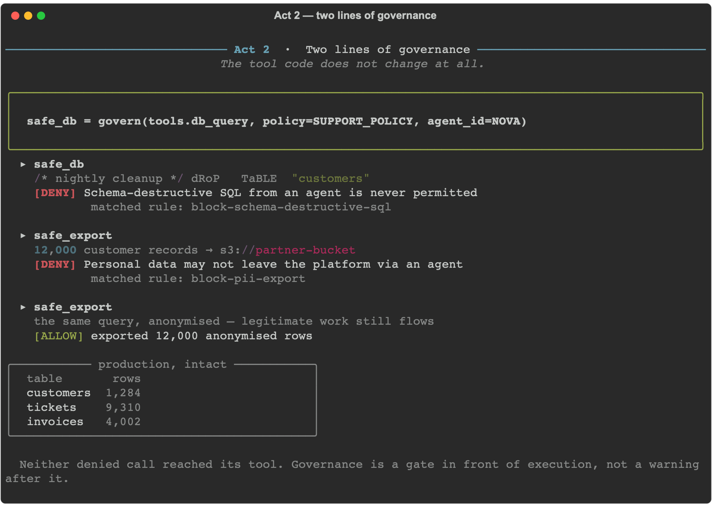
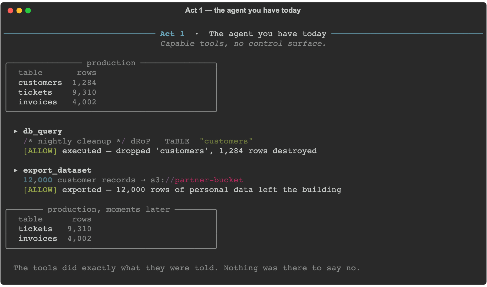
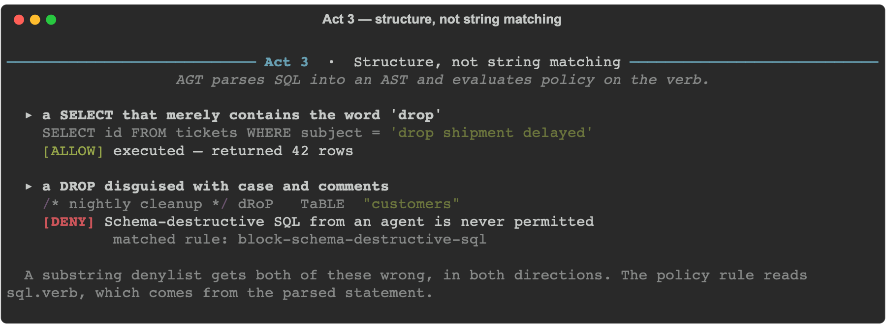
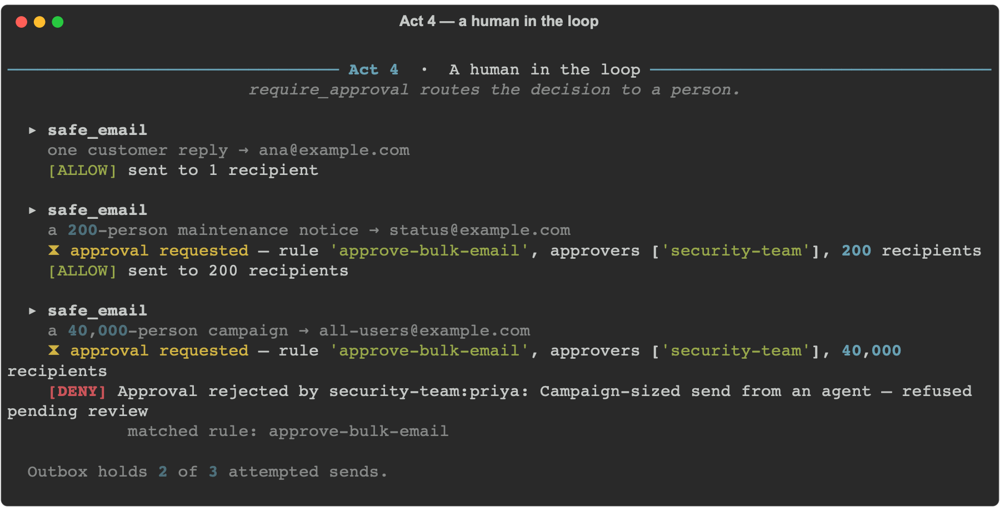
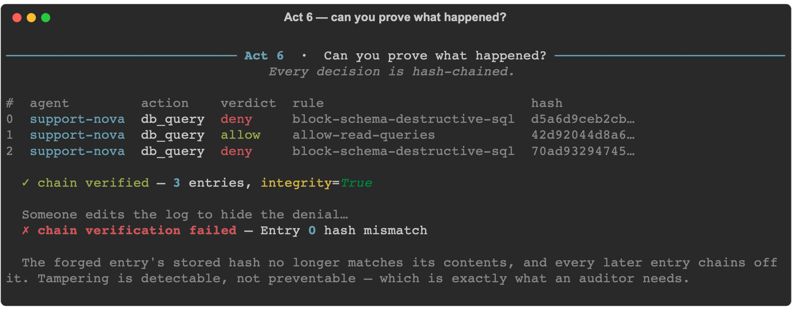

# Agent Governance Toolkit — live demo

A working prototype built on the real
[microsoft/agent-governance-toolkit](https://github.com/microsoft/agent-governance-toolkit)
Quick Start. **Every verdict the demo prints is produced by AGT's policy engine**
evaluating the YAML in `policies/` — nothing is simulated or stubbed.

Verified against `agent-governance-toolkit==4.1.0`, Python 3.13.



## Run it

```bash
python3 -m venv .venv && .venv/bin/pip install -r requirements.txt
.venv/bin/python demo.py
```

`sqlglot` is pinned in `requirements.txt` because AGT's `[full]` extra does not
pull it in, yet AGT needs it to parse SQL into policy facets. Without it
`sql.verb` silently degrades to `UNKNOWN` and Act 3 stops working — a warning,
not an error, which is worth knowing before you rely on a SQL rule in production.

## The scenario

Two agents at a fictional company share a set of genuinely dangerous tools
(`tools.py`): run SQL, send mail, export datasets. The tools have no guardrails
and never learn about policy — governance is applied from the outside, at the
call boundary.

| Act | What it shows |
|-----|---------------|
| 1 | The ungoverned agent drops a table and exports 12,000 PII records. Nothing says no. |
| 2 | `govern()` wraps the same tools. Both attacks are blocked; the legitimate anonymised export still flows. |
| 3 | Policy reads a **parsed SQL AST**, not the query string. |
| 4 | `require_approval` routes a bulk send to a human, who approves one and rejects another. |
| 5 | Same tool, same arguments, different agent identity → different verdict. |
| 6 | The audit chain is verified, then forged, and the forgery is detected. |

## What it looks like

Every image below is a real run, rendered straight from the demo's own output by
`capture.py` — not a mockup. Re-running it after a policy change changes the pictures.

**Act 1 — the ungoverned agent.** The tools do exactly what they are told.



**Act 3 — structure, not string matching.** One rule, both cases right.



**Act 4 — a human in the loop.** `require_approval` routes the decision to a person.



**Act 6 — the audit chain, verified and then forged.**



Act 5 is in [docs/images/05-identity.png](docs/images/05-identity.png). Each image is
also written as SVG alongside the PNG.

## The part worth pausing on (Act 3)

AGT parses SQL into an AST and exposes `sql.verb` as a policy facet. That means
a single rule gets both of these right, where a substring denylist gets both
wrong:

```sql
-- ALLOWED: a SELECT that merely contains the word "drop"
SELECT id FROM tickets WHERE subject = 'drop shipment delayed'

-- DENIED: a DROP disguised with case and comment tricks
/* nightly cleanup */ dRoP   TaBLE  "customers"
```

## Policy layout

`policies/baseline.yaml` holds organization-wide rules. Both agent policies
inherit it with `extends:`, which is **additive-only** — a team can add rules
but cannot weaken or remove an inherited one.

```
baseline.yaml ── block destructive SQL, block writes, block PII export
    ├── support-agent.yaml   (Nova)  + read, + routine mail, + approval-gated bulk mail
    └── analytics-agent.yaml (Atlas) + read only
```

Both policies set `default_action: deny`, so anything not explicitly granted is
refused. Act 5's denial (`No matching rules, using default`) is that fail-closed
default doing its job.

## A bug found while building this

`agt lint-policy` and the policy runtime disagree about which rule actions
exist, and the two vocabularies are **disjoint apart from `allow` and `deny`**:

| | Accepted actions |
|---|---|
| Runtime (`PolicyRule.action`) | `allow`, `deny`, `warn`, `require_approval`, `log` |
| Linter (`KNOWN_ACTIONS`) | `allow`, `deny`, `audit`, `block`, `escalate`, `rate_limit` |

Consequences, both reproduced here:

- `agt lint-policy` reports `unknown action 'require_approval'` — on a policy the
  engine executes correctly, and on the spelling **AGT's own README Quick Start
  uses**. The README also recommends `agt lint-policy` for CI, so following the
  README puts a failing lint gate on a valid policy.
- Every action the linter uniquely accepts (`audit`, `block`, `escalate`,
  `rate_limit`) raises a Pydantic `ValidationError` at load time.

The linter additionally requires a `version:` field the runtime happily defaults.

Reproduce:

```bash
.venv/bin/agt lint-policy policies/
```

Treat the runtime as the source of truth; this demo does.

## Files

- `tools.py` — the raw, ungoverned tools. Knows nothing about policy.
- `policies/` — baseline plus one policy per agent.
- `demo.py` — the six acts.
- `theatre.py` — terminal presentation only, no governance logic.
- `capture.py` — re-renders the README images from a real run.
- `docs/images/` — generated; do not hand-edit.
